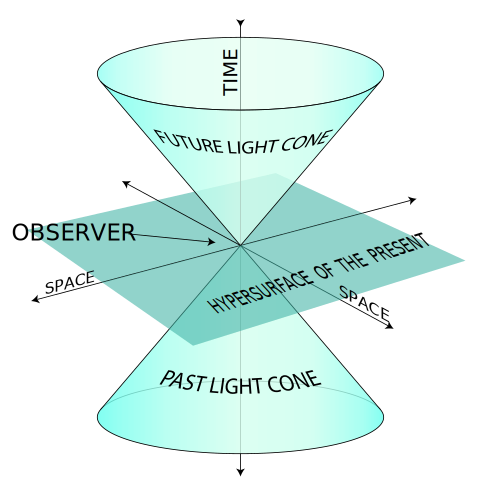

# Mechanics of flat spacetime

[TOC]

## Flat relativity spacetime

### Relativity principle

**The relativity principle**: All natural laws are the same in all inertial reference frames.

**The propagation speed of interactions**: The maximum propagation speed of interaction is the same in all inertial reference frames (as can be derived from the principle of relativity). It can be proven that this speed is the speed of light in a vacuum.
$$
c = 2.998 × 10^8 m/s
$$

### Minkowski Space-time

$$
(t, x, y, z)
$$

Minkowski spacetime is a four-dimensional manifold that combines three-dimensional Euclidean space and time. 

#### Space-Time Interval: Minkowski Metric

the space-time interval between two events in Minkowski space is given by the equation:
$$
\begin{align*}
  s_{12} &= (c^2 (t_2-t_1)^2 - (x_2-x_1)^2 - (y_2-y_1)^2 - (z_2-z_1)^2)^{\frac{1}{2}}  \\
  \mathrm{d} s &= (c^2 \mathrm d t^2 - \mathrm d x^2 - \mathrm d y^2 - \mathrm d z^2)^{\frac{1}{2}}
\end{align*}
$$

### Lorentz Transformation

$$
\begin{align*}
    \left(\begin{matrix} ct' \\ x' \\ y' \\ z' \end{matrix}\right) &= \left(\begin{matrix} 
    \frac{1}{\sqrt{1-(\frac{V}{c})^2}} & \frac{-\frac{V}{c}}{\sqrt{1-( \frac{V}{c} )^2}}  \\
    \frac{-\frac{V}{c}}{\sqrt{1-( \frac{V}{c} )^2}} & \frac{1}{\sqrt{1-( \frac{V}{c} )^2}} \\
    & & 1\\ & & & 1 \end{matrix}\right)   \left(\begin{matrix} ct \\ x \\ y \\ z \end{matrix}\right)
  \end{align*}
$$
  设两个惯性参考系 $K, K'$, 其中$K'$沿$x$轴以速度$V$相对于$K$作相对运动.

#### Transform of speed
$$
\begin{align*}
v_x &= \frac{v'_x + V}{1 + \frac{v'_x V}{c^2}}\\
v_y &= \frac{v'_y \sqrt{1 - \frac{V^2}{c^2}}}{1 + \frac{v'_x V}{c^2}}\\
v_z &= \frac{v'_z \sqrt{1 - \frac{V^2}{c^2}}}{1 + \frac{v'_x V}{c^2}}
\end{align*}
$$

## Action

### Action of flat relativity spacetime

$$
S = \int L \, d\tau\\
d\tau = \sqrt{1 - \frac{v^2}{c^2}}\mathrm{d}t
$$

## Appendix

### Proof of Lorentz Transformation

If the relative velocities of the new and old reference frames remain constant, then the reference frame transformation is a linear transformation
$$
\left(\begin{matrix} c t' \\ x' \\ y' \\ z' \end{matrix}\right) = \boldsymbol A   \left(\begin{matrix} c t \\ x \\ y \\ z \end{matrix}\right)
$$
The principle of constant speed of light. The required reference frame transformation can ensure that all event intervals before and after the transformation remain unchanged in Minkowski spacetime.
$$
\begin{align*}
Δs^2 &= c^2 Δt^2 - Δx^2 - Δy^2 - Δz^2 \\
    &= c^2 Δt'^2 - Δx'^2 - Δy'^2 - Δz'^2  \\
    &= const.
\end{align*}
$$
化为矩阵式, 可解得 $\boldsymbol η = \boldsymbol A^T \boldsymbol η \boldsymbol A$.
$$
\begin{align*}
\Rightarrow \quad &   \left(\begin{matrix} c Δt \\ Δx \\ Δy \\ Δz \end{matrix}\right)^T   \left(\begin{matrix} -1 \\ & 1\\ & & 1\\ & & & 1 \end{matrix}\right)   \left(\begin{matrix} c Δt \\ Δx \\ Δy \\ Δz \end{matrix}\right) =   \left(\begin{matrix} c Δt' \\ Δx' \\ Δy' \\ Δz' \end{matrix}\right)^T   \left(\begin{matrix} -1 \\ & 1\\ & & 1\\ & & & 1 \end{matrix}\right)   \left(\begin{matrix} c Δt' \\ Δx' \\ Δy' \\ Δz' \end{matrix}\right) = const.  \\
\Rightarrow \quad & \boldsymbol p^T \boldsymbol η \boldsymbol p = \boldsymbol p'^T \boldsymbol η \boldsymbol p'  \tag{simplified form}  \\
    & \boldsymbol p^T \boldsymbol η \boldsymbol p = (\boldsymbol A \boldsymbol p)^T \boldsymbol η (\boldsymbol A \boldsymbol p)  \tag{substitution}  \\
    & \boldsymbol p^T \boldsymbol η \boldsymbol p = \boldsymbol p^T \boldsymbol A^T \boldsymbol η \boldsymbol A \boldsymbol p  \tag{transposition}  \\
\Rightarrow \quad & \boldsymbol η = \boldsymbol A^T \boldsymbol η \boldsymbol A  \tag{Matrix calculation}
\end{align*}
$$
The only transformations that can satisfy the condition of constant event interval are translation and rotation Excluding familiar transformations such as translation, three-dimensional spatial rotation, spatial reflection, and time inversion, we focus on the rotation within the $(tx, ty, tz) $plane Assuming that the y-axis and z-axis do not undergo transformation, only the t-axis and x-axis undergo transformation to simplify the problem and eliminate three-dimensional spatial rotation, it can be concluded that,
$$
\begin{align*}
\Rightarrow \quad\left(\begin{matrix} c Δt' \\ Δx' \end{matrix}\right) &= \boldsymbol A_{t,x}   \left(\begin{matrix} c Δt \\ Δx \end{matrix}\right)  \\
\left(\begin{matrix} -1 \\ & 1 \end{matrix}\right) &= \boldsymbol A_{t,x}   \left(\begin{matrix} -1 \\ & 1 \end{matrix}\right) \boldsymbol A_{t,x}  \\
\Rightarrow \quad \boldsymbol A_{t,x} &= \left(\begin{matrix} a & b \\ c & d \end{matrix}\right) , \text{where} \left\{\begin{matrix}
    -a^2 + c^2 = -1  \\
    -b^2 + d^2 =  1  \\
    -a b + c d =  0
    \end{matrix}\right.
\end{align*}
$$

It can be seen that the hyperbolic function $cosh ^ 2 x - sinh ^ 2 x=1$is a solution that satisfies the system of equations, which is the rotation transformation matrix of the $t$-$x$ plane,
$$
\boldsymbol A_{t,x} =   \left(\begin{matrix} \cosh μ & \sinh μ \\ \sinh μ & \cosh μ \end{matrix}\right)
$$
In the new inertial reference frame, the origin coordinate is always zero, while in the old inertial reference frame, the origin of the new system moves along the x axis at a velocity of $V$, and the substitution can be solved $μ$ And the objective transformation matrix

$$
\left(\begin{matrix} c t' \\ 0 \end{matrix}\right) = \boldsymbol A_{t,x} \left(\begin{matrix} c t \\ V t \end{matrix}\right) =   \left(\begin{matrix} \cosh μ & \sinh μ \\ \sinh μ & \cosh μ \end{matrix}\right)   \left(\begin{matrix} c t \\ V t \end{matrix}\right)
$$
$$
\begin{align*}
\Rightarrow \quad  & μ = \text{arctanh}\left(-\frac{V}{c}\right)\\
\Rightarrow \quad  & \left\{\begin{matrix}
-\tanh μ = -\frac{V}{c} = \frac{\sinh μ}{\cosh μ}  \\
-\cosh^2 μ - \sinh^2 μ = 1
\end{matrix}\right.  \\
\Rightarrow \quad  & \left\{\begin{matrix}
-\sinh μ = \frac{-\frac{V}{c}}{\sqrt{1 - (\frac{V}{c})^2}}  \\
-\cosh μ = \frac{1}{\sqrt{1 - (\frac{V}{c})^2}}
\end{matrix}\right.  \\
\Rightarrow \quad  &   \left(\begin{matrix} c t' \\ x' \end{matrix}\right) =   \left(\begin{matrix}\frac{1}{\sqrt{1-( \frac{V}{c} )^2}} & \frac{-\frac{V}{c}}{\sqrt{1-(\frac{V}{c} )^2}}\\ \frac{-\frac{V}{c}}{\sqrt{1-( \frac{V}{c} )^2}} & \frac{1}{\sqrt{1-( \frac{V}{c} )^2}}\end{matrix}\right)   \left(\begin{matrix} c t \\ x \end{matrix}\right)  \\
\end{align*}
$$

